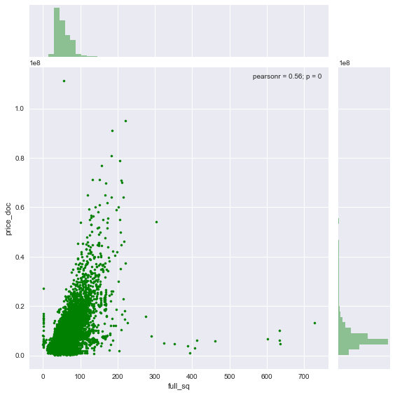
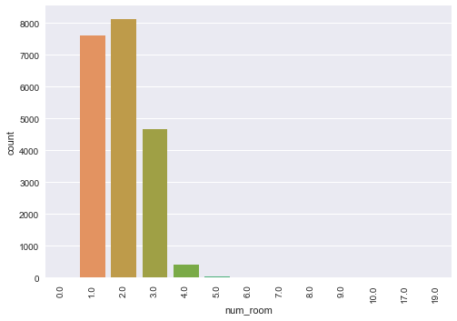

# Data exploration

Variable importance of the dataset, as shown [here](https://www.kaggle.io/svf/1146201/177cd62d6ec42abfe3d9b2740cbe5632/__results__.html#importance) (had problems running xgboost, so couldn't recreate it):

```
## rf variable importance
## 
##   only 20 most important variables shown (out of 435)
## 
##                             Overall
## full_sq                      100.00
## life_sq                       81.72
## num_room                      74.27
## kitch_sq                      62.34
## build_year                    59.64
## max_floor                     50.68
## product_typeOwnerOccupier     38.57
## state                         37.34
## office_sqm_1500               34.63
## mosque_km                     33.02
## museum_km                     32.84
## green_part_1000               32.38
## railroad_station_avto_min     31.88
## detention_facility_km         31.72
## office_km                     31.27
## cafe_sum_1500_max_price_avg   30.85
## metro_min_avto                30.71
## sport_count_1500              30.69
## university_km                 30.24
## cafe_avg_price_1000           30.12
```

## full_sq

_full_sq: total area in square meters, including loggias, balconies and other non-residential areas._

```
plt.figure()
plt.plot(trainset['full_sq'], trainset['price_doc'], "o",
         color="g", ms=5)
plt.show()
```


Filter out the outlier and plot new dataset:

```
# Remove outlier
filtered = trainset[trainset['full_sq'] < 4000]

sns.jointplot(x="full_sq", y="price_doc", data=filtered,
              color="g", size=8, s=10)
```



Most houses are around 50 square meters, and go up to 100, with some houses going up to 200 or more.

## life_sq

_life_sq: living area in square meters, excluding loggias, balconies and other non-residential areas_

```
plt.figure()
plt.plot(trainset['life_sq'], trainset['price_doc'], "o",
         color="g", ms=5)
plt.show()
```


Filter out the outlier and plot new dataset:

```
# Remove outlier
filtered = trainset[trainset['life_sq'] < 7000]

sns.jointplot(x="life_sq", y="price_doc", data=filtered,
              color="g", size=8, s=10)
```


Same as with full_sq, life_sq has most points centered around 50-100 square meters.

## num_room

_num_room: number of living rooms_

```
sns.countplot(x="num_room", data=trainset)
```



2 and 1 floors are most frequent, followed by 3. All other values are much lower.

## kitch_sq

_kitch_sq: kitchen area_

```
plt.figure()
plt.plot(trainset['kitch_sq'], trainset['price_doc'], "o",
         color="g", ms=5)
plt.show()
```


Get a closeup of the rest of the data points:

```
# Get closeup of data
filtered = trainset[trainset['kitch_sq'] < 500]

sns.jointplot(x="kitch_sq", y="price_doc", data=filtered,
              color="g", size=8, s=10)
```


Most kitchens in the set aren't larger than 20 square meters.

## build_year

These are the unique values found in build_year (as integers):

```
[          0           1           3          20          71         215
        1691        1860        1876        1886        1890        1895
        1896        1900        1904        1905        1906        1907
        1910        1911        1912        1914        1915        1917
        1920        1924        1925        1926        1927        1928
        1929        1930        1931        1932        1933        1934
        1935        1936        1937        1938        1939        1940
        1941        1943        1946        1947        1948        1949
        1950        1951        1952        1953        1954        1955
        1956        1957        1958        1959        1960        1961
        1962        1963        1964        1965        1966        1967
        1968        1969        1970        1971        1972        1973
        1974        1975        1976        1977        1978        1979
        1980        1981        1982        1983        1984        1985
        1986        1987        1988        1989        1990        1991
        1992        1993        1994        1995        1996        1997
        1998        1999        2000        2001        2002        2003
        2004        2005        2006        2007        2008        2009
        2010        2011        2012        2013        2014        2015
        2016        2017        2018        4965    20052009 -2147483648]
```

There are some weird values here, like all years before 1000 (Moscow wasn't founded until around the 14th century), all values after 2018 (2018 seems reasonable as a future building project), and NaN. Filter and plot the remaining values:

```
# Remove outliers
filtered = trainset[~pd.isnull(trainset)]
filtered = filtered[(filtered.build_year > 1600)
    & (filtered.build_year != 4965)
    & (filtered.build_year != 20052009)]

sns.jointplot(x="build_year", y="price_doc", data=filtered,
              color="g", size=8, s=10)
```


Most buildings in the set are built after 1950, and more expensive buildings appear after 2000.